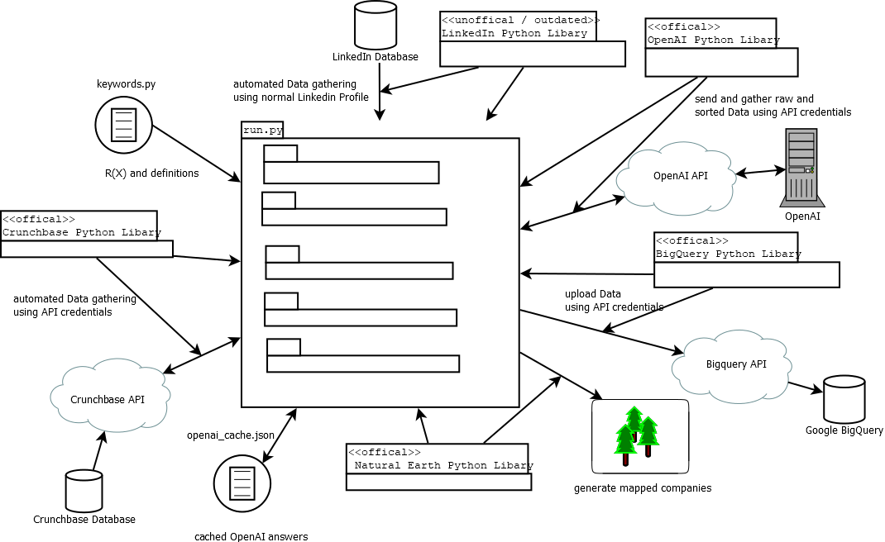
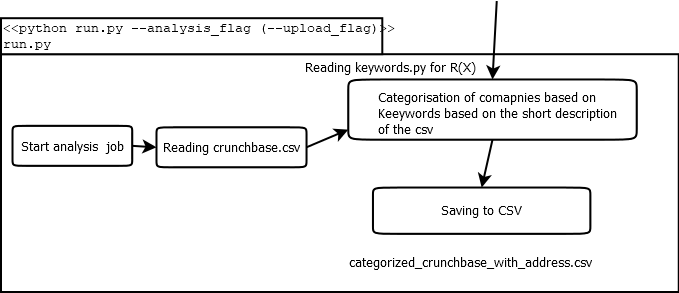

# Circular Economic Start-Ups Masterthesis Florian Jäger

# Table of Contents

* [Table of Contents](#table-of-contents)
* [Getting Started](#getting-started)
  * [Tech Stack](#tech-stack)
* [Setup](#setup)
   * [Preparation](#preparation)
   * [Settings](#settings)
   * [Run the Program](#run-the-program)
* [Client Functionality](#client-functionality)
  * [LinkedIn Client](#linkedin-client)
  * [Crunchbase Client](#crunchbase-client)
  * [BigQuery Client](#bigquery-client)
* [Data Analysis](#data-analysis)
* [Miscellaneous](#miscellaneous)
  * [Coding Conventions](#coding-conventions)
    * [Python](#python)
* [Tests](#tests)
* [Documentation](#documentation)
   * [Architecture](#architecture)
   * [Module Structure](#module-structure)
* [API Keys and Deployment Setup](#api-keys-and-deployment-setup)
  * [API Keys](#api-keys)
* [Todos](#todos)

# Getting Started
This repository contains the integrated data handling and analysis application for extracting, transforming, and uploading data from sources like Crunchbase and LinkedIn.

## Tech Stack
The project uses the following tech/software stack:
* **Python**
* **Docker**/**Kubernetes**/**Ansible**: For deployment and orchestration.

# Setup
## Preparation
Clone this repository to your local system:

1. Install [Python 3.12](https://www.python.org/downloads/release/python-3121/) (do not add it to your PATH environment if you have another Python version on your system).
2. Use the following commands in your project root directory to create and activate a virtual Python environment:

```bash
# Make sure you have Python 3.12 installed and change the path to the install path on your system
/c/Programme/Python312/python -m venv .venv
# Switch to your new environment
source .venv/Scripts/activate
# Upgrade pip
python -m pip install --upgrade pip
# Install the necessary libraries
pip install -r requirements.txt
# Deactivate your virtual environment with:
deactivate
```

### Settings
Create a `env_base.env` file on your local system with the following environment variables:

```bash
MODE="DEV"
STAGE="local"
# Google Cloud Config
GOOGLE_PROJECT_ID=""
GOOGLE_DATASET_ID=""
GOOGLE_PRIVATE_KEY_ID=""
GOOGLE_PRIVATE_KEY=""
GOOGLE_CLIENT_EMAIL=""
GOOGLE_CLIENT_ID=""
GOOGLE_AUTH_URI=""
GOOGLE_TOKEN_URI=""
GOOGLE_AUTH_PROVIDER_X509_CERT_URL=""
GOOGLE_CLIENT_X509_CERT_URL=""
# API Keys
CRUNCHBASE_API_KEY=""
CRUNCHBASE_BASE_URL=""
LINKEDIN_ACCOUNT=""
LINKEDIN_PWD=""
OPENAI_API_KEY=""
```
Fill in the variables with your own keys or request them from an admin. The `DEV` mode is for local development to prevent data uploads from a developmental state.

### Run the Program
Execute the program with the following command:
```bash
python run.py --download_flag --upload_flag --linkedin_flag --analysis_flag --validation_flag --mapping_flag
```
Add arguments as needed. The example above fetches data and uploads it to BigQuery using environment settings.

For help, use:
```bash
python run.py -h
```

**(!) Be careful when running locally, as it can overwrite important data on live systems, especially when the upload_flag is set.**

**Tip: Set `MODE` to `DEV` in your `env_base.env` file to prevent accidental uploads.**

# Client Functionality

## LinkedIn Client

The LinkedIn client handles the retrieval of company information from LinkedIn. It logs into LinkedIn using provided credentials and fetches detailed company profiles based on company names. This client ensures robust error handling and re-attempts failed operations, leveraging custom retry logic.
* **`Features:`**:

Initialize connection with account credentials.
Fetch and return detailed company information from LinkedIn.
Robust error handling and logging of operations.

## Crunchbase Client

The Crunchbase client is designed to interact with the Crunchbase API to fetch company data based on structured queries. It supports operations like counting companies that match a query and retrieving detailed company data.

* **`Features:`**:

Initialize API connectivity with an API key and base URL.
Count companies matching specific criteria.
Fetch detailed data for companies, supporting pagination and specific field queries.
Detailed error handling including specific Crunchbase API error codes.

## BigQuery Client

The BigQuery client manages interactions with Google's BigQuery service, enabling the storage, querying, and analysis of large datasets within Google Cloud.

* **`Features:`**:

Handles the creation, configuration, and deletion of datasets and tables within your Google Cloud project.
Supports uploading structured data from various sources into BigQuery for analysis.
Facilitates running complex SQL queries against stored data, enabling deep analytics and insights.

# Data Analysis

The Data Analysis module is pivotal in transforming raw data from platforms like Crunchbase into actionable insights, primarily focusing on startup ecosystems. It applies sophisticated categorization and analytical techniques to provide a deeper understanding of the data.

## Key Features

- **Categorization Using Startup Descriptions:** Utilizes the 9R framework and business model types to categorize startups based on their descriptions. This process involves parsing the descriptions to identify keywords that match predefined categories, calculating the relevance of each category based on the occurrence of these keywords.

- **Percentage Calculations:** For each startup, the percentage of keywords falling into specific categories (9R and Business Model) is calculated. This provides a quantifiable measure of the focus areas for each company.

- **Filtering and Reporting:** Filters out startups that do not meet certain criteria, such as having an 'Uncategorized' status in both the 9R and Business Model categories. The filtered dataset is then prepared for further analysis or reporting.

- **Data Integration:** The processed data can be easily integrated with other modules, enabling seamless data flow into tools like BigQuery for further analysis or visualization.

## Workflow

1. **Data Extraction:** Start by extracting data from the `crunchbase.csv` file, which includes essential details about each startup.

2. **Data Transformation:** Apply the categorization logic to each row in the dataset. This involves parsing the descriptions to categorize startups and calculating the percentage relevance for each category.

3. **Data Validation:** Take the pre processed, and filtered data and let it analyse and validated through OpenAI.

4. **Data Cleaning and Preparation:** Post-categorization, the data is cleaned to remove entries that do not provide sufficient information for analysis. The cleaned dataset is then formatted for easy integration with databases or further analytical processes.

5. **Mapping:** This step takes the preprocessed data from previous processes and mapped it with the help of natural earth on a german map.

6. **Export and Integration:** The final step involves exporting the categorized and cleaned data to a CSV file for easy access and integration with other parts of the application, such as data uploading to BigQuery or visualizations.

## Tools and Technologies

- **Python:** Primary programming language used for data manipulation and analysis.
- **Pandas:** Leveraged for data manipulation and cleaning.
- **Custom Python Scripts:** Specific scripts like `analysis.py` perform the categorization and percentage calculations.

This module is crucial for decision-makers looking to understand market trends, identify emerging business models, and assess the startup landscape based on data-driven insights.


# Miscellaneous

## Coding Conventions
### Python
We adhere to the [PEP 8 standard](https://www.python.org/dev/peps/pep-0008/) and our docstrings follow the [Google style guide](https://google.github.io/styleguide/pyguide.html#Comments).

Before committing, run `flake8` over your code to ensure compliance. See [using hooks with flake8](http://flake8.pycqa.org/en/latest/user/using-hooks.html) for setting up git hooks and editor plugins.

**-> Always keep your code simple, modular, and readable.**

# Tests
Unit tests or automated tests are not implemented yet.

## Architecture
The application is designed to run as a cron job within a Docker container across different environments.







## Module Structure
Describes the functionality and organization of various modules like `bigquery`, `linedin_request`, `crunchbasee`,  `openai_request`, `helpers`, `tasks`, `logger`, and `config` that are integral to the operation of the system.

* **`bigquery`**: Client and methods for the connection to Google BigQuery.
* **`linedin_request`**: Client and methods for the connection to LinedIn.
* **`crunchbasee`**: Client and methods for the connection to Crunchbase.
* **`openai_request`**: Client and methods for the connection to OpeenAI.
* **`company_keywords`**: R-Framework with names and definitions.
* **`cache`**: Cache folder for mapping and OpenAI answers.
* **`reporting`**: Folder for the downloaded, and analysed CSVs.
* **`helpers`**: Utility functions and decorators.
* **`tasks`**: Individual job files for data fetching and uploading.
* **`logger`**: Logging module that handles both standard and error logging.
* **`config`**: Manages all configuration settings for the application.

The main function in `run.py` orchestrates all necessary modules and their functions.
